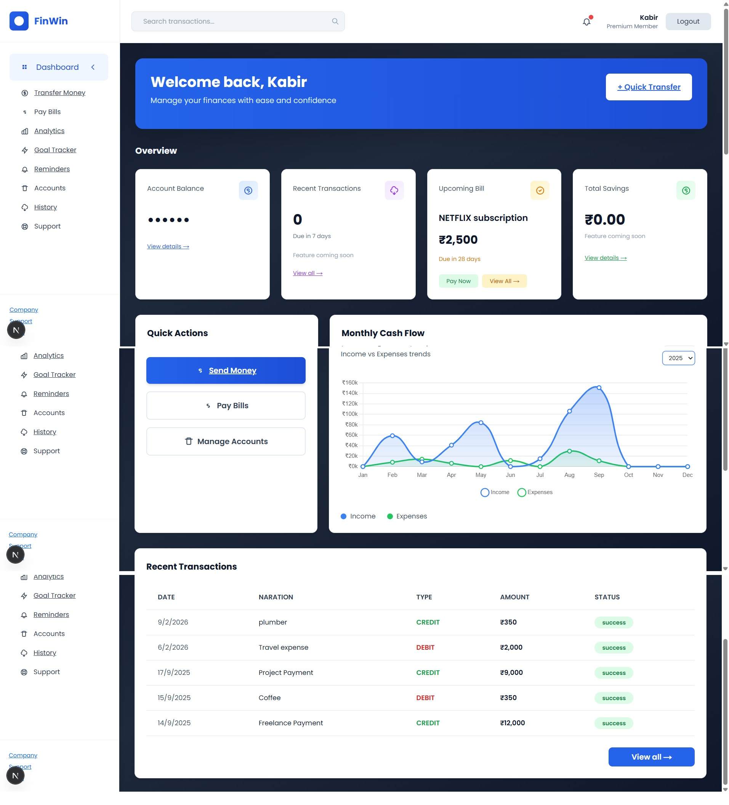
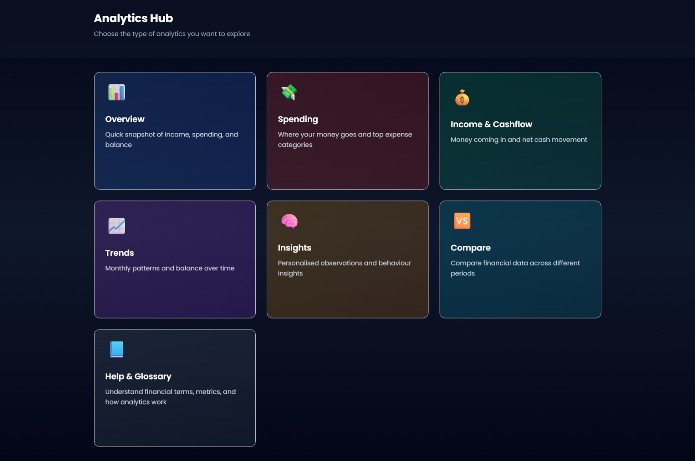
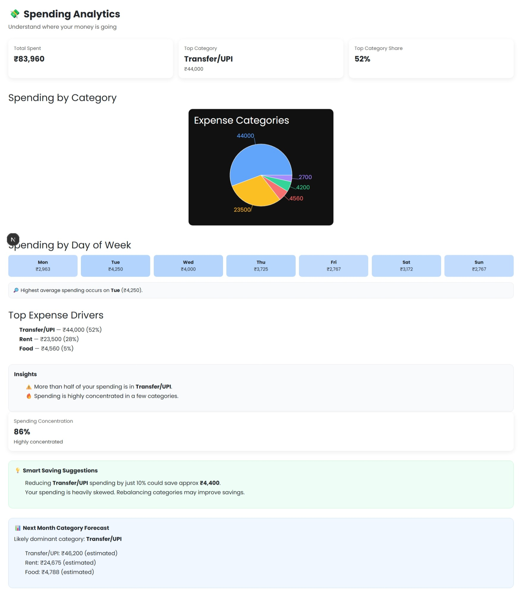
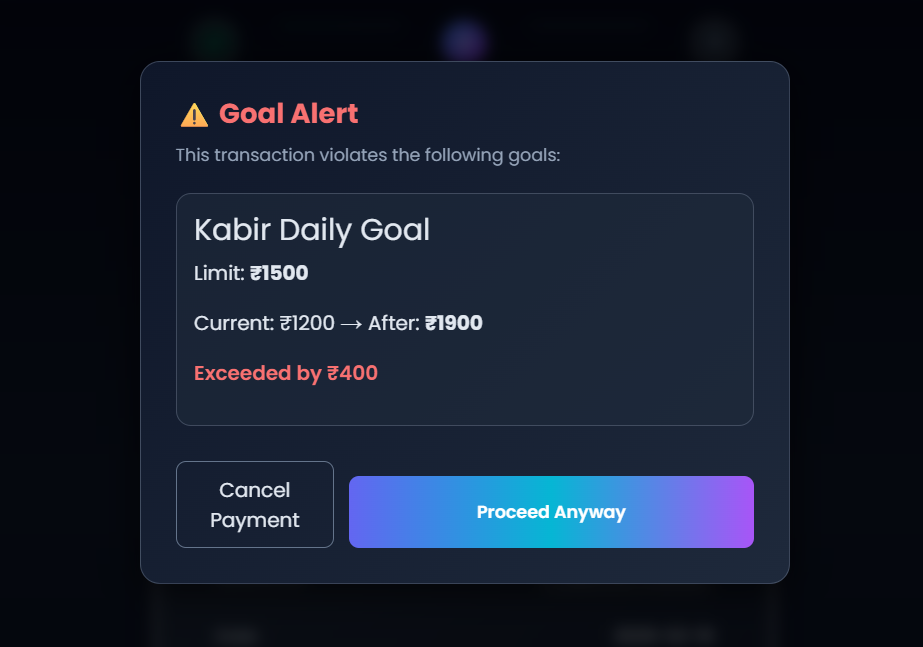

# 💳 FinWin – Smart Core Banking Platform

> A modern core banking platform that combines secure banking operations with intelligent financial analytics to help users better understand, manage, and optimize their spending.


---

## 📖 Overview

FinWin is a next-generation banking platform designed to provide traditional banking functionality alongside intelligent financial insights.

Beyond basic banking operations such as account management and transaction processing, FinWin leverages transaction analytics, rule-based intelligence, and machine learning-assisted categorization to help users understand their financial behavior and make informed decisions.

---

## ✨ Key Features

### 🏦 Banking Module

- Secure user authentication
- Role-based access (Customer, Cashier, Admin)
- Account management
- Deposit & withdrawal
- Fund transfer
- UPI transactions
- Credit card transactions
- Transaction history

---

### 📊 Analytics Dashboard

Provides personalized financial insights including:

- Monthly Income vs Expense Analysis
- Spending by Category
- Spending Heatmap
- Cash Flow Analysis
- Monthly Comparison
- Financial Health Score
- Spending Trends
- Savings Suggestions
- Expense Forecasting
- Category-wise Analytics

---

### 🤖 Intelligent Analytics

- Transaction categorization
- Rule-based merchant recognition
- ML-assisted narration classification
- Spending concentration analysis
- Silent drain detection
- Top expense drivers
- Smart saving recommendations
- Monthly expense prediction

---

### 🎯 Goals & Reminders

- Monthly spending goals
- Category-based limits
- Goal violation alerts
- Payment reminders

---

### 🔒 Security

- Secure Authentication
- Password Encryption
- Role-Based Access Control
- Protected API Routes
- Secure Database Access

---

# 🧠 Technologies Used

## Frontend

- Next.js (App Router)
- React
- TypeScript
- Tailwind CSS
- Chart.js

## Backend

- Next.js API Routes
- Prisma ORM
- PostgreSQL
- Supabase

## Analytics

- Python
- Pandas
- NumPy
- Scikit-learn

## Database

- PostgreSQL
- Supabase

---

# 🏗️ System Architecture

```
                    User
                      │
                      ▼
               Next.js Frontend
                      │
          ┌───────────┴───────────┐
          ▼                       ▼
 Authentication            Analytics APIs
          │                       │
          ▼                       ▼
     Supabase Auth          Data Processing
          │                       │
          └───────────┬───────────┘
                      ▼
                 PostgreSQL
                      │
                      ▼
             Banking Transactions
                      │
                      ▼
          Analytics & ML Engine
```

---

# 📊 Analytics Features

### Spending Analytics

- Category-wise Expense Distribution
- Weekday Spending Heatmap
- Spending Concentration Analysis
- Silent Drain Detection
- Smart Saving Suggestions

### Income & Cash Flow

- Monthly Income
- Monthly Expense
- Net Balance
- Cash Flow Trends

### Compare Analytics

- Month-to-Month Comparison
- Income Growth
- Expense Growth
- Savings Rate Comparison

### Insights

- Top Expense Category
- Biggest Purchase
- Savings Rate
- Financial Health Score
- Spending Trend
- Expense Prediction

---

# 🧮 Analytics Techniques Used

- Data Aggregation
- Rule-Based Categorization
- Machine Learning Classification
- Percentage Analysis
- Trend Analysis
- Time-Series Aggregation
- Category Forecasting
- Statistical Metrics
- Financial KPI Calculation

---

# 🛠️ Tech Stack

| Category | Technologies |
|-----------|--------------|
| Frontend | Next.js, React, TypeScript |
| Backend | Next.js API Routes |
| Database | PostgreSQL, Supabase |
| ORM | Prisma |
| Analytics | Python, Pandas, NumPy |
| Machine Learning | Scikit-learn |
| Charts | Chart.js |
| Authentication | Supabase Auth |

---

# 📁 Project Structure

```
app/
│
├── analytics/
├── api/
├── dashboard/
├── login/
├── signup/
│
lib/
utils/
prisma/
ml/
```

---

# 🚀 Getting Started

## Clone Repository

```bash
git clone https://github.com/shreyakm21/FinWin.git
```

## Install Dependencies

```bash
npm install
```


## Run Application

```bash
npm run dev
```

---

# 📸 Screenshots

> Add screenshots here

- Dashboard
  
- Analytics Overview
  
- Spending Analytics
  
- Goal Violation
  

---

# Future Enhancements

- AI-powered financial assistant
- Budget planning
- Personalized investment suggestions
- Fraud detection
- Explainable AI recommendations
- Multi-bank integration
- Real-time notifications
- MFA / Face-detection login entry

---

# 👩‍💻 Authors

**Shreya Mamadapur**\
**Snehal Jadhav**\
**Rutuja Hulge**\
**Sakshi Jagadale**

B.E. Information Technology

---

# ⭐ If you found this project interesting, consider giving it a star!
